## Deploying 

### First Time Deployment 

#### 1. Create a New App in Heroku

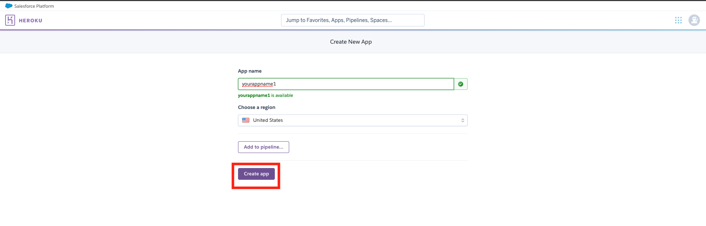

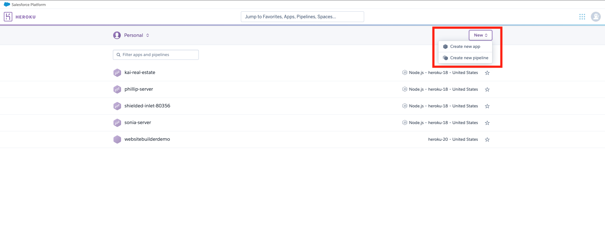

#### 2. SetUp Heroku CLI

Download [Heroku CLI](https://devcenter.heroku.com/articles/heroku-cli#download-and-install) 

LogIn to Heroku with your terminal

        heroku login

Add Heroku remote branch to the current git repository

        heroku git:remote -a *heroku app name*

#### 3. Deploy App to Heroku

In your  terminal:

        git add .
        git commit -am "make it better"
        git push heroku master

#### 4. Buy a domain with GoDaddy

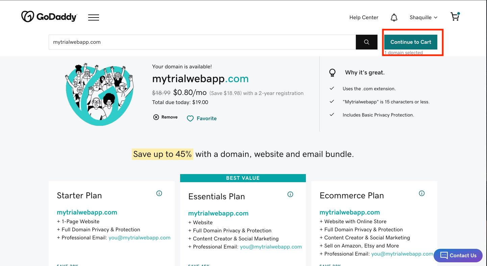

#### 5. Use Cloudflare to manage your DNS settings instead of GoDaddy

Navigate to Cloudflare, add site (choose free option), copy the nameservers

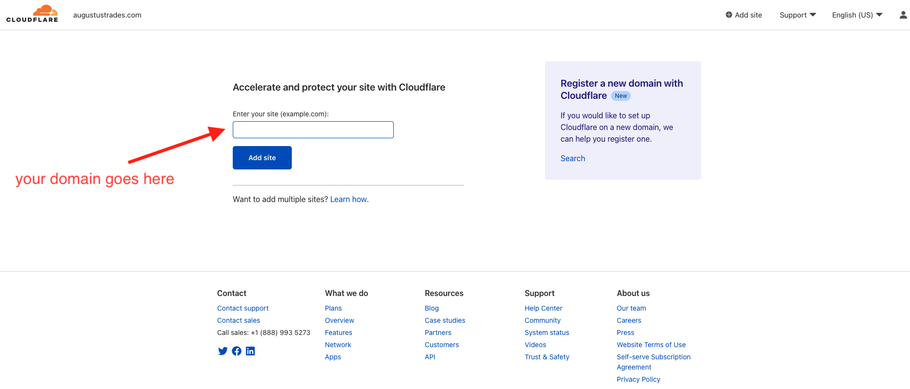

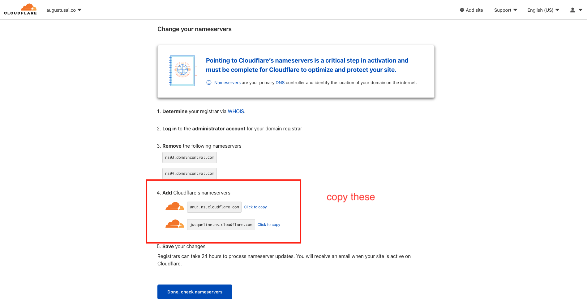

Navigate to GoDaddy, go to your websites DNS settings, and replace nameservers with the ones that were given

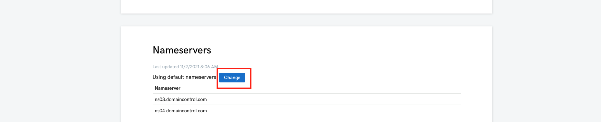

place namservers from cloudflare here

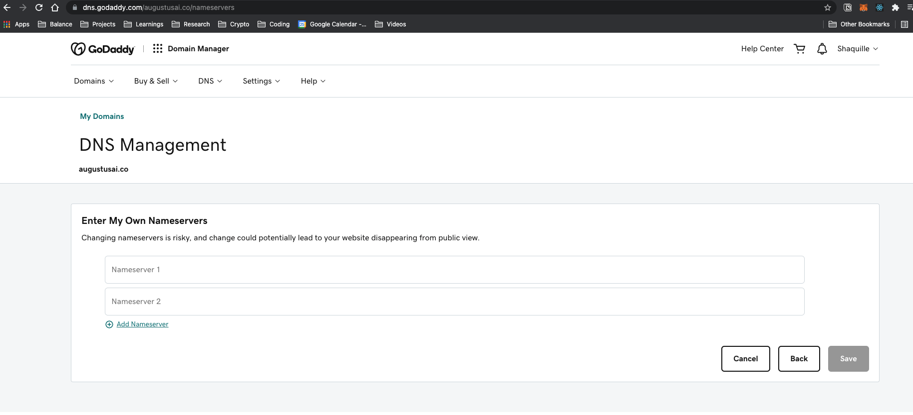

#### 6. Update your DNS setting to allow domain to point to Heroku server

We want our domain name to point to our heroku app

Navigate to Heroku, add your domain, and copy the DNS target. This should look as follows:

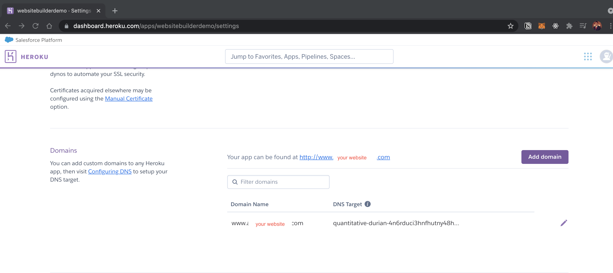

Navigate to Cloudflare, on your websites DNS tab, edit the CNAME target to point to Heroku DNS target

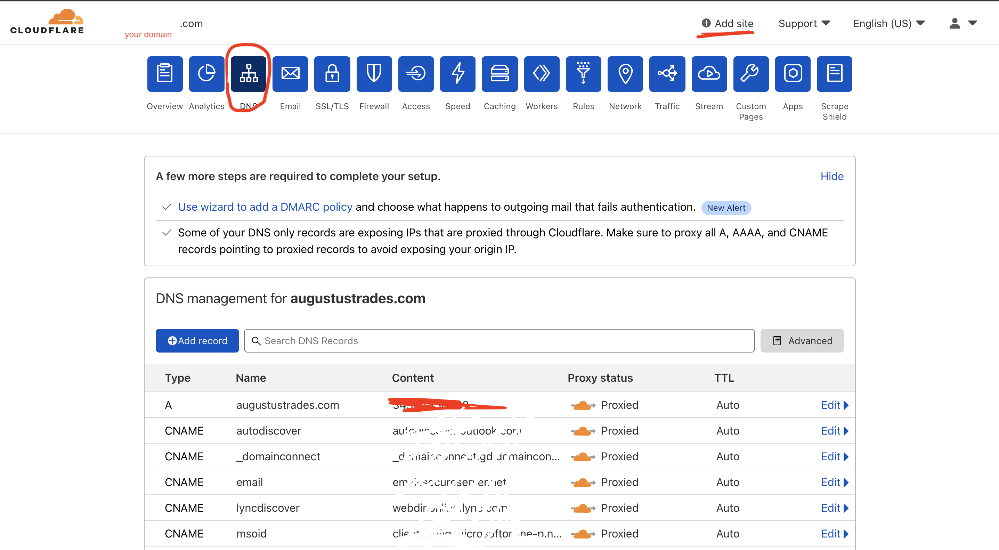

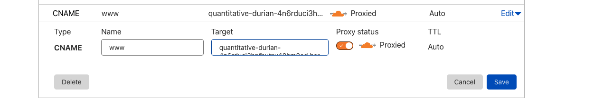

#### 6. Add SSL Certificate

Navigate to the SSL tab for your domain on cloudflare and add a flexible ssl

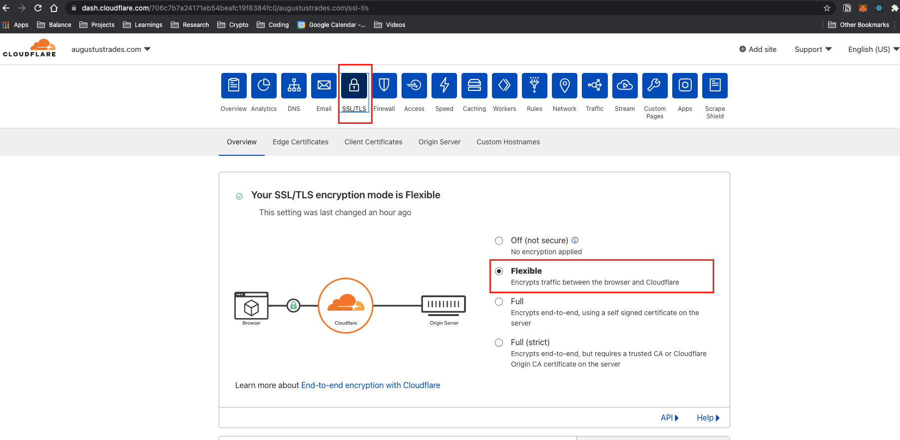

#### 6. Forward all similar domains to your ssl connection

Navigate to the Rules tab for your domain on cloudflare and add these list of rules based on below

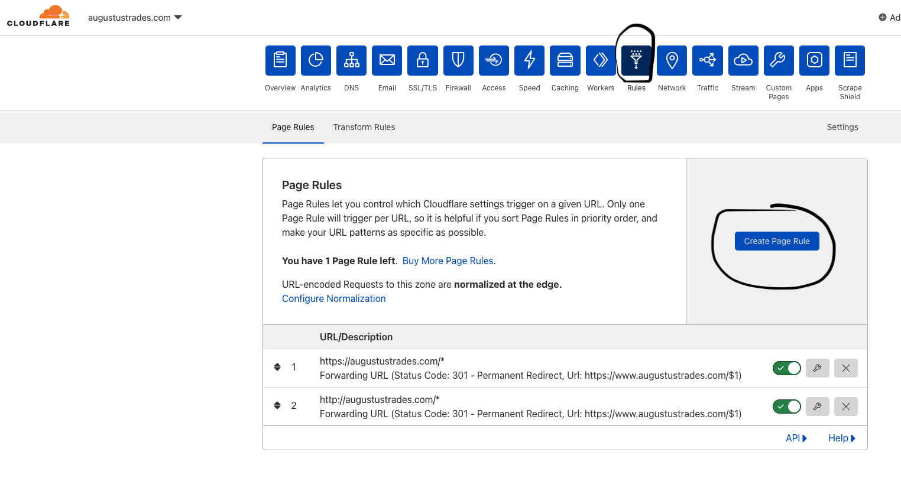

Add three rules, keep the settings in blue the same for all three. Change the settings in red to reflect the following:

        http://www.your_domain.com/*
        http://your_domain.com/*        
        https://your_domain.com/*

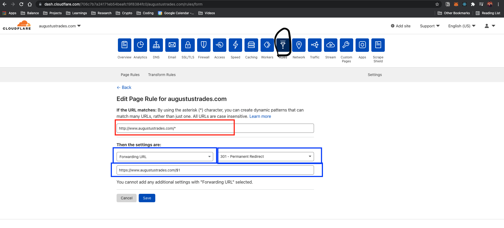

### Subsequent Deployments

In your  terminal:

        git add .
        git commit -am "make it better"
        git push heroku master
